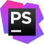

# Infinite

### Group project started during our first week off from BeCode training (22/11/2021 - 26/11/2021)

## **Challenge**
Using ReactJS for the first time we are trying to build a website that scrolls infinitely by rendering new randomized landing pages.

## **The objective of this exercise**

* Get our first experience in ReactJS
* Learn to build functional and class based components
* Build templates based on those components
* Use an MVC model throughout the process
* Learn as much fun tricks as possible
* Have fun!

## **Tools and languages used**

|  | Description | Who? |
| ----------- | ----------- |----------|
|  | Ubuntu 20.04 | Sven|
|  | Windows 10 | Jörg, Daryl, Stefan |
|  | PHPStorm | Sven, Jörg |
| | VSCode | Daryl, Stefan |
|  | HTML5 | All |
|  | CSS3 | All |
|  | JS | All |
|  | ReactJs | All |
|  | Using git for version control | All |
|  | Hosting my files on github | All |

## Resources
- [Font API](https://developers.google.com/fonts/docs/developer_api)
- [Image API](https://unsplash.com/developers)
- [Color API](http://www.thecolorapi.com/)
- [Jeff Goldblum Quote API](https://jeffsum.com/)
- [Complementary Colors Package](https://www.npmjs.com/package/complementary-colors)

## **Must Haves**
### **Structure**
- Get everyones configurations working
- Configure sth to format code
- Follow import protocol in index files
- 
### **Landing page**
    - Explain concept
    - NavBar to github profiles and project repo
    - Instructions
    - Scrolls to project
### **Random pages**
    - Nav to github profiles and project repo
    - Header ->
        - Title
    - Section ->
        - Background
        - Text
        - Image(s)

## **Nice to Haves**
- Component animation(s)

## **Components So Far**
- Text
- Image
- Title
- Link
- Button

## **Getting Started with Create React App**

This project was bootstrapped with [Create React App](https://github.com/facebook/create-react-app).

## **Available Scripts**

In the project directory, you can run:

### `yarn start`

Runs the app in the development mode.\
Open [http://localhost:3000](http://localhost:3000) to view it in the browser.

The page will reload if you make edits.\
You will also see any lint errors in the console.

## Learn More

You can learn more in the [Create React App documentation](https://facebook.github.io/create-react-app/docs/getting-started).

To learn React, check out the [React documentation](https://reactjs.org/).